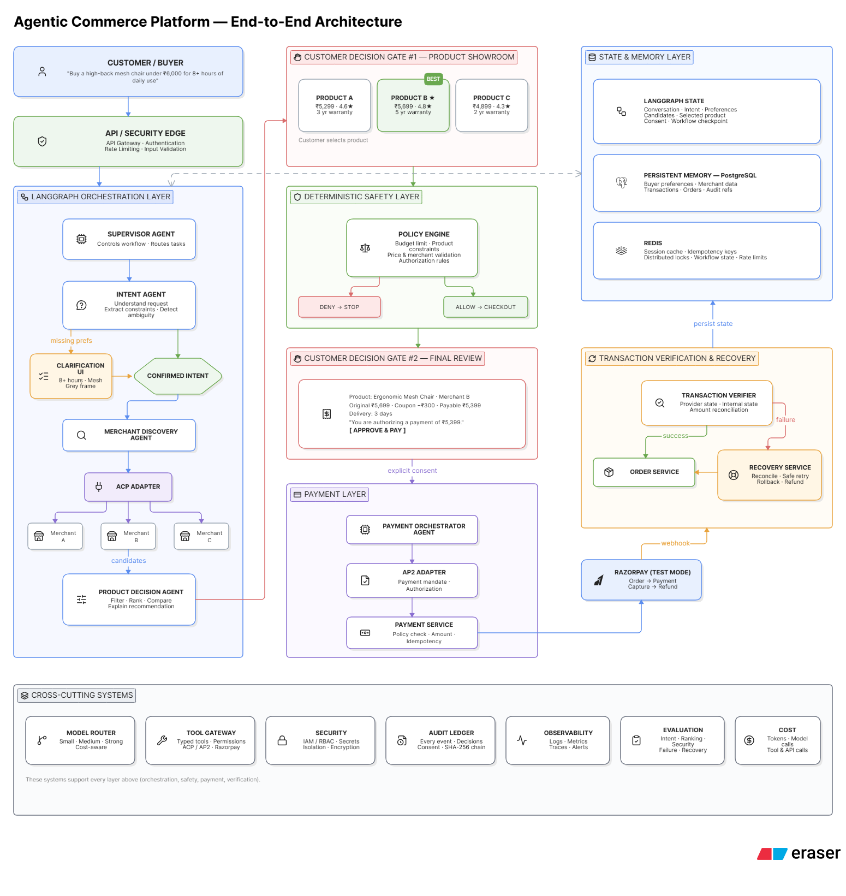

# E2E Agent (End-to-End Agentic Commerce)

## ⚠️ The Problem
Handing over a credit card to an AI is terrifying. Nobody will adopt "Agentic Commerce" if the AI can accidentally drain their bank account on hallucinated purchases or if hackers can spoof client payloads to bypass payment authorization. Current LLM-based shopping bots lack the **Trust Infrastructure** required to securely gate and bound financial transactions autonomously.

## 💡 The Solution
**E2E Agent** is a production-grade Agentic Commerce platform that makes merchants transactable by AI buyers end-to-end, with an unbreakable security firewall. It introduces the **Mandate Wallet** and **Policy Engine** architecture to ensure that every single autonomous money action is:
1. **Explainable:** Driven by deterministic scoring, and cryptographically logged in an append-only Audit Ledger.
2. **Bounded:** Strictly capped by global lifetime wallet budgets and hard mandate limits that are securely locked in the database, ignoring spoofable client payloads.
3. **Gated:** Automatically intercepts and halts transactions that exceed your Auto-Pay thresholds, falling back gracefully to manual confirmation.

## 🏗️ Architecture


## 🔄 End-to-End Flow
1. **Wallet Allocation:** User allocates a lifetime budget in the Mandate Wallet UI.
2. **Intent Creation:** User chats with the LLM (e.g., *"buy a green cotton casual saree for 5000"*). The **Intent Agent** translates this into a strictly structured `IntentMandate` and saves it securely to the database along with the user's Auto-Pay limits.
3. **Product Discovery & Ranking:** The agent discovers products, intelligently relaxing the search budget up to 30% if needed, and deterministically scores them across 6 dimensions (Value, Specs, Coupons, etc.).
4. **Checkout Assembly & Policy Gate:** The **Policy Engine** evaluates the selected product against the user's hard limits and Auto-Pay limits securely stored in the DB.
5. **Execution / Graceful Failures:** 
   - **Success:** If within limits, the **Payment Orchestrator** executes an autonomous Server-to-Server (S2S) Razorpay token capture.
   - **Auto-Pay Exceeded:** Halts gracefully and requests manual user approval ("Approve & Pay").
   - **Hard Mandate Exceeded:** The Policy Engine strictly rejects the purchase to protect the user's wallet.
   - **Token Rejection:** If Razorpay rejects the autonomous token, the UI gracefully falls back to the standard manual Razorpay popup.
6. **Recovery & Refunds:** Handles cancellations and asynchronous `pending_refund` tracking dynamically in the Wallet dashboard.

## 📂 Folder Structure
```text
.
├── app/                  # FastAPI Backend
│   ├── agents/           # LLM Agents (Intent, Ranking, Discovery)
│   ├── api/              # API Routes (Chat, Checkout, Wallet, Audit)
│   ├── db/               # PostgreSQL Models & Database Connection
│   ├── protocols/        # AP2 (Agent Protocol 2) Mandate Definitions
│   └── services/         # Policy Engine, Payment Executor, Recovery Service
├── frontend/             # React/Vite Frontend
│   ├── src/
│   │   ├── App.tsx       # Main Chat, Wallet Dashboard, and Ledger UI
│   │   └── main.tsx
├── docs/                 # Documentation & Assets
├── scripts/              # Database Seeding Scripts
└── docker-compose.yml    # Container Orchestration
```

## 🚀 Quick Start (Docker)
This project is fully containerized. You can launch the entire database, backend, and frontend stack with a single command!

### 1. Clone the repository
```bash
git clone <repository_url>
cd agentic-commerce
```

### 2. Environment Variables
Ensure your `.env` file (if required for Razorpay or LLM keys) is populated in the root directory.

### 3. Run the complete stack
```bash
docker-compose up --build -d
```

### 4. Access the application
- **Frontend UI:** `http://localhost:5174` (or port 5173 depending on your Docker configuration)
- **Backend API Docs:** `http://localhost:8000/docs`

### 5. Useful Docker Commands
```bash
# View backend agent logs in real-time
docker-compose logs -f agentic-commerce-app

# View frontend logs
docker-compose logs -f agentic-commerce-frontend

# Restart the backend after making code changes
docker restart agentic-commerce-app-1

# Stop all containers
docker-compose down
```
